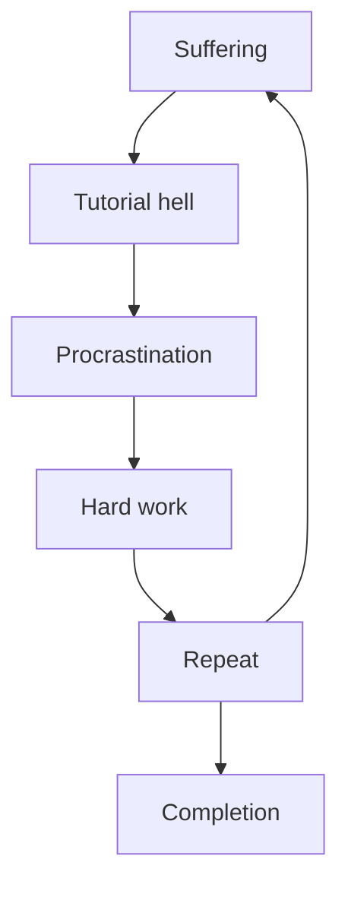

# How to contribute

- Create a useful and well made pull request.
- wait for it to be discussed and potentially accepted.
- To assist in creating this helpful pull request, we have included a diagram.

