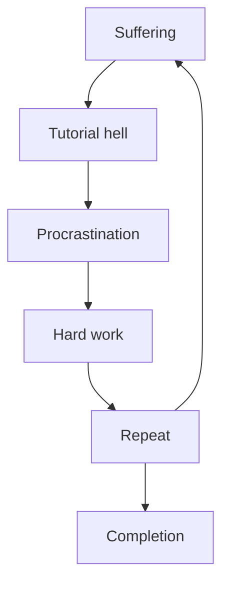

# Lost Items! 

Welcome to the Lost Items project. This is a website that allows users to check their lost items online. If a user finds an item that they have lost, they can press the claim button to request the aforementioned item. This request will be sent to the administrators of the site for processing[^1].

## Features

- **Item Catalogue**: Users can browse through the lost items in our [catalogue](catalogue/index.html).
- **Claim Requests**: Users can press a claim button to request a lost item. This request is sent to the site administrators for approval (wip).
- **A Dashboard**: You can see information through the [dashboard](dashboard/index.html)[^2].
- **User Login**: Users need to [login](login/index.html) to be able to claim items[^1].

## Installation

To install and run this project locally, follow these four steps:

1. Clone the repository: `git clone https://github.com/yourlostitems/yourlostitems.github.io.git`
2. Navigate to the project directory: `cd yourlostitems.github.io`
3. Install the dependencies: `npm install`
4. Start the development server: `npm start`

## Usage

To use the Lost Items Finder website, follow these steps:

1. Open your favoured web browser and navigate to the [website URL](https://yourlostitems.github.io/).
2. Browse through the various lost items in the catalog.
3. Login to your account to be able to claim items[^1].
4. If you find an item that you have lost, press the claim button to request it and we will try to respond to your request as soon as possible[^1].
5. Administrators can approve or reject your item request(s) through the dashboard[^1].

## Technologies Used

This project utilizes the following technologies to enhance the capabilities of the website:

- HTML
- CSS
- JavaScript

## Roadmap

We have the following plans for future development:

- Add a password-protected secure administrator dashboard to allow the processing of item requests.
- Create a functioning system for the uploading of lost items (potentially through the aforementioned administrator dashboard).
- Allow users to upload images of these lost items.
- Improve the user interface and overall design of the website.
- Enhance the administrator dashboard with more features.

## Support

If you have any questions or need assistance with the Lost Items Finder project, please make an issue on this repository and we will try our best to fix it. We are commited to supporting our customers no matter what and we hope to foster a vibrant and active community around our excellent product.

## Contributing

We welcome contributions from the community. If you would like to contribute to this project, please follow the guidelines outlined in our [CONTRIBUTING.md](CONTRIBUTING.md) file. As above, we hope to foster a vibrant and active community around our excellent product.

## Code of Conduct

We expect all contributors and users of this project to adhere to our [CODE_OF_CONDUCT.md](CODE_OF_CONDUCT.md). Please read it to get a full understanding of our amazing community's standards and practices.

## Our workflow

[^1]: This is currently work in progess.
[^2]: The dashboard is functional but all functional information is work in progress
